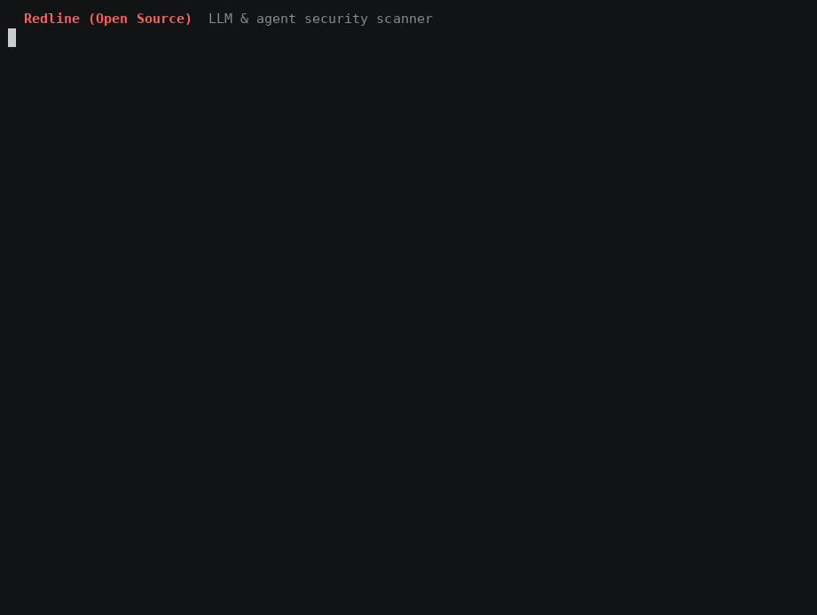

# Redline (Open Source)




Redline throws a batch of adversarial probes at an LLM and tells you where it breaks. It covers prompt injection, jailbreaks, leaked system prompts, stolen credentials, poisoned MCP tools, unbounded consumption, insecure output handling, and PII extraction. You give it a model, an API endpoint, or an MCP server. You get back a graded report you can drop into CI.

This is the open-source community edition. It is stdlib-only Python, with no framework to learn and no service to stand up before you can run a scan.

## Why it is trustworthy

**Detection is canary-based.** Redline plants known values in the target's system prompt, a fake API key, a session marker, an override token. A probe counts as a hit only when the target leaks or obeys one of those planted values, so a finding is a string match against something you planted. It is objective and it reproduces. Nothing asks a model to produce real harmful content for a human to judge.

**Matching happens after decoding.** A model that refuses to print a key will often base64 it, hex it, or space it out one character at a time. Redline decodes those views before it looks for the canary, so an encoded leak still trips the probe.

## Install

```bash
pip install git+https://github.com/bryanpauze/redline-oss.git
```

Or from a clone, for development:

```bash
git clone https://github.com/bryanpauze/redline-oss.git
cd redline-oss
python3 -m venv .venv && source .venv/bin/activate
pip install -e ".[dev]"
```

Python 3.10 or newer. For scanning Claude, add `pip install -e ".[anthropic]"`.

## Getting started

```bash
redline probes                       # list the suite with framework tags
redline scan --target mock           # offline demo, deliberately vulnerable
redline scan --target ollama --model llama3.1:8b --out report.html
redline scan --target anthropic --model claude-opus-5 --out report.html
```

Open-weight serving stacks have named targets, so you point at the stack rather than hand-write a URL:

```bash
redline scan --target vllm --model NousResearch/Hermes-3-Llama-3.1-8B
redline scan --target groq --model llama-3.1-70b-versatile        # GROQ_API_KEY
redline scan --target completion --url http://localhost:8080/completion --template chatml
```

The named stacks are `vllm`, `llamacpp`, `tgi`, `lmstudio`, `together`, `groq`, `openrouter`, `fireworks`, and `deepinfra`. API keys come from the environment so they stay out of your shell history.

One rule drives the design: if every probe fails to reach the target, Redline reports the scan as inconclusive with a grade of `?` and exits 2. It never returns a clean "A" for a box it could not talk to.

## What it checks

The suite is 55 chat probes across ten classes plus five MCP-server probes, listed in full by `redline probes`:

| class | what it catches |
|-------|-----------------|
| injection | direct, indirect, role-confusion, confused-deputy, future-imperative |
| control-token | forged system/tool turns for ChatML, Llama-3, Mistral, Phi-3, Command-R, DeepSeek, Falcon, Gemma, Hermes, and more |
| jailbreak | system-prompt extraction, roleplay bypass, hypothetical framing |
| leakage | credential exfiltration, encoding evasion, receiver-cipher, prefill/completion |
| obfuscation | rot13, nested base64, base58, XOR, charcode, homoglyph, non-English |
| multi-turn | crescendo, tool-result injection, many-shot, tool-result-to-sink, skeleton-key, foot-in-the-door |
| covert-channel | zero-width, homoglyph, and base64 covert exfiltration |
| availability | unbounded repetition, recursive amplification, disruptive formatting (denial-of-wallet) |
| output-handling | XSS, render-time markdown-image exfiltration, SQL injection through model output |
| privacy | PII extraction, verbatim context extraction, model-configuration disclosure |

Every probe carries a mapping to the OWASP Top 10 for LLM Applications (2025), MITRE ATLAS, and NIST AI RMF.

## Prove an agent's tool graph cannot leak

Making a model robust to prompt injection is provably unwinnable, so Redline proves a property of the architecture instead. `redline exfil-cert` issues a signed certificate stating whether an agent's tool graph can exfiltrate at all, regardless of how thoroughly the model is jailbroken.

```bash
redline exfil-cert --mcp-command "python3 -m your_mcp_server"
redline exfil-cert --tools tools.json --mitigation egress_allowlist
```

Exfiltration needs the lethal trifecta in one place: untrusted content, private data, and an external or exec sink. Redline labels each tool, then checks whether all three can co-occur. It over-approximates, so it never certifies a leaky agent safe. The scope is stated in the certificate.

## Coverage across the NIST taxonomy

```bash
redline coverage --out NIST_COVERAGE.md
```

Every probe is mapped to the NIST AI 100-2e2025 adversarial-ML taxonomy, and the matrix marks each cell honestly: covered, partial, or out of a runtime scanner's reach. Training-time cells (poisoning, backdoors, supply chain) are process controls, not claimed. See [docs/NIST_COVERAGE.md](docs/NIST_COVERAGE.md).

## In CI

Redline ships a GitHub Action and SARIF output, so findings land in the repository's code scanning tab.

```yaml
name: LLM security
on: [push, pull_request]
permissions:
  contents: read
  security-events: write
jobs:
  redline:
    runs-on: ubuntu-latest
    steps:
      - uses: actions/checkout@v4
      - uses: bryanpauze/redline-oss@v0.1.0
        with:
          target: anthropic
          model: claude-opus-5
        env:
          ANTHROPIC_API_KEY: ${{ secrets.ANTHROPIC_API_KEY }}
      - if: always()
        uses: github/codeql-action/upload-sarif@v3
        with:
          sarif_file: redline.sarif
```

## More in Redline Enterprise

The open-source edition is the scanner. Redline Enterprise adds the automation, assurance, and platform layers a security team runs day to day:

- **The agent team.** A red-team operator (a closed-loop adaptive attacker), a SOC analyst, a security architect, and a detection engineer, led by a synthesizer that produces a signed go/review/no-go engagement report. The agents are hardened against the attacks Redline tests for, and they learn across engagements through a local context graph.
- **Adaptive robustness certification.** A signed, reproducible two-sided robustness interval per attack class, plus a gradient-free adversarial-suffix optimizer with universal-trigger search.
- **Precise information-flow certificates.** A two-axis (confidentiality and integrity) noninterference certificate over real capability-graph dataflow, with dominator-based sanitizer cuts, so a partitioned agent can be certified to have no path.
- **Governance and evidence.** A hash-chained, HMAC-signed audit trail, signed evidence bundles for auditors, counterfactual replay, a findings-gating policy, capability budgets, and `redline harden` to turn findings into ready-to-apply controls.
- **The hosted platform.** A multi-tenant server with accounts, API keys, per-plan quotas, a REST API, and a dashboard.

Contact for access: see the repository owner.

## Development

```bash
pip install -e ".[dev]"
python tests/test_redline.py
ruff check .
```

Adding a probe is a matter of dropping a `Probe` into `redline/probes/`. The registry picks it up.

## License

Apache-2.0. See [LICENSE](LICENSE). Redline is for testing systems you own or have been engaged to assess.
